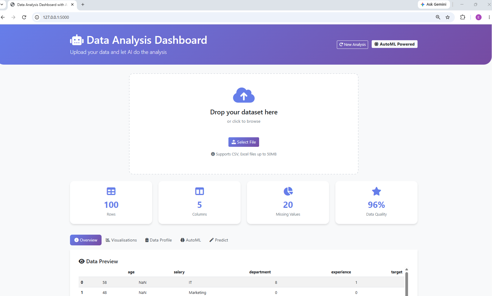

# Data Analysis Dashboard with AutoML

An interactive web dashboard that lets you upload a CSV/Excel dataset, automatically profile it, generate visualisations, train ML models and make predictions — all without writing code.



## Features

- **File Upload** — drag-and-drop CSV or Excel files (up to 50MB).
- **Multi-sheet Excel** - when a workbook has multiple sheets, a selector appears; switching re-profiles and re-charts the new sheet without re-uploading.
- **Data Profiling** — automatic column statistics, missing-value analysis, data quality score.
- **Auto-Visualisations** — 5–7 auto-generated Plotly charts, intelligently chosen based on column types.
- **AutoML** — trains Random Forest, Gradient Boosting and (Logistic/Linear) Regression; picks the best performer.
- **Feature Importance** — ranks the top 10 predictive features.
- **Predictions** — enter feature values and get instant model predictions with probabilities.
- **Model Export** — download the trained model bundle as a `.pkl` file.

## Tech Stack

| Layer | Technology |
|---|---|
| Web framework | Flask |
| Data manipulation | pandas, NumPy |
| Visualisation | Plotly (Express + Graph Objects) |
| Machine Learning | scikit-learn |
| Model persistence | joblib |
| Frontend | Bootstrap 5 + vanilla JavaScript |

## Installation

```bash
# Clone the repo
git clone https://github.com/lizkodjo/AutoML_Dashboard.git
cd AutoML_Dashboard

# Create and activate a virtual environment
python -m venv venv
source venv/bin/activate      # macOS/Linux
venv\Scripts\activate         # Windows

# Install dependencies
pip install -r requirements.txt

# Configure your secret key
cp .env.example .env
# Edit .env and set SECRET_KEY to a random hex string

# Run the app
python run.py
```

Then open http://localhost:5000 in your browser.

## Usage

1. **Upload a dataset** — drag a CSV/Excel file onto the upload area
2. **Explore the tabs** — Overview, Visualisations, Data Profile, AutoML, Predict
3. **Run AutoML** — click "Run AutoML" in the AutoML tab to train models
4. **Predict** — open the Predict tab, fill in feature values (or use "Fill with example"), and click Predict

## Project Structure

```
AutoML_Dashboard/
├── run.py                      # Development entry point
├── config.py                   # Config classes (Dev/Test/Prod)
├── requirements.txt
├── requirements-dev.txt        # pytest
├── pytest.ini
├── .env.example
├── README.md
├── scripts/
│   └── create_test_excel.py    # Dev utility for generating Excel fixtures
├── dashboard/
│   ├── __init__.py             # create_app() factory
│   ├── ml/                     # AutoML, profiler, visualiser
│   │   ├── __init__.py
│   │   ├── auto_ml.py
│   │   ├── profiler.py
│   │   └── visualiser.py
│   ├── routes/                 # HTTP blueprints
│   │   ├── __init__.py
│   │   ├── main.py             # /, /clear_session
│   │   ├── upload.py           # /upload
│   │   ├── analysis.py         # /analyse, /generate_chart, /suggest_features, /switch_sheet
│   │   ├── ml.py               # /predict, /model_info, /download_model
│   │   └── export.py           # /export_results
│   ├── services/
│   │   ├── __init__.py
│   │   ├── json_utils.py       # to_jsonable(), jsonify_safe()
│   │   └── session_store.py    # Session-scoped file persistence (CSV + Excel meta)
│   ├── templates/
│   │   └── index.html
│   └── static/
│       ├── dashboard.js
│       └── style.css
├── tests/
│   ├── __init__.py
│   ├── conftest.py
│   └── test_app.py
└── uploads/                    # gitignored
    ├── data/
    └── models/
```

## How It Works

### Data Flow

1. `/upload` — file is saved, parsed into pandas, persisted as CSV under a session UUID, profiled and visualised.
2. `/analyse` — the CSV is reloaded, AutoML trains three models, the best is saved to `uploads/models/<session>.pkl`.
3. `/predict` — the model bundle is loaded, incoming JSON is encoded/scaled to match training and a prediction is returned.

### Session Isolation

Each browser session gets its own UUID. Uploaded data and trained models are keyed by that UUID. This makes the app safe for concurrent users and lets users start over with `/clear_session`.

### JSON Serialisation

Pandas and NumPy produce types (`numpy.int64`, `numpy.float64`, `Timestamp`) that Python's `json` module can't serialise. The `_json_default` callback in `app.py` handles these globally — every response goes through `json_safe()` before being returned.

## Known Limitations

- **Numeric imputation at predict-time** uses `0`, not the training means — small distribution shift for missing numeric inputs
- **No authentication** — the session UUID is the only isolation mechanism
- **In-memory training** — large datasets (>100k rows) will be slow; consider background workers for production
- **No target selection UI** — AutoML guesses the target column heuristically

## License

MIT